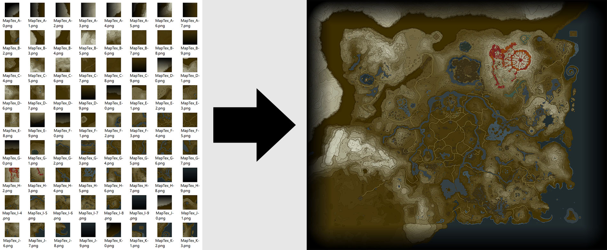

# Introduction
_Spriter's Resource_ user [Random Talking Brush](https://www.spriters-resource.com/submitter/Random+Talking+Bush/)
extracted the images used to display the map in _Legend of Zelda: Breath of the Wild_, but it's all divided up
into square tiles, and there are also separate tile variations for different states of the map. 
This Python 3 script stitches together the tiles into single images.



# Basic Use
First, make sure you have the actual map files (download [here](https://www.spriters-resource.com/wii_u/thelegendofzeldabreathofthewild/)).
Depending on what you want to do, you don't need to download them all.
 * The "Map (Full)" archive contains everything needed to make a map at the highest quality (24,000x20,000 pixels) with all regions visible, 
   although it will NOT have the complete Tarrey Town and Eldin Bridge will be up.
    - To get complete Tarrey Town and lowered Eldin Bridge, you can additionally download the "Map Variants (I-L)" archive.
 * The "Map (Lower-Resolution)" archive contains everything needed to make 100% complete maps 
   (i.e. all regions visible, Tarrey Town complete, and Eldin Bridge down) at any lower resolution
 * The Variants archives contain the additional tiles needed to make highest-quality maps with regions missing.
 * The "Map (Empty)" archive contains everything needed to make
   a completely empty map (i.e. just the background pattern and borders).

(For reference, here is what I mean when I talk about Tarrey Town and Eldin Bridge:)

 
**VERY IMPORTANT!!!**: Be sure to extract all of the archives into the _same folder_. The folder structure should look like this:
```
Legend of Zelda - Breath of the Wild\
  Map\
    Empty\
    Full\
  Map1\
    Empty\
    Full\
  Map2\
    Empty\
    Full\
  Map3\
    Empty\
    Full\
```
 
Finally, download the python script and flagmasks.txt. You can run the script like this:
```
python stitchmap.py <folder containing Map, Map1, etc.> [-o output_filename] [-l level_of_detail] [-r visible_regions] [-t tarrey_town_state] [-b bridge_state]
```
For more details on the parameters, see the "Argument Details" section. However, here are parameters for some of the most common commands:
  * Full-quality map with just all regions visible (no tarrey town, bridge up): `<folder> -l0 -r all -t0 -bup`
  
  * Full-quality 100% complete map (tarrey town complete, bridge down): `<folder> -l0 -r all -t5 -bdown`
  * Lower-quality 100% complete map (tarrey town complete, bridge down): `<folder> -l1 -r all -t5 -bdown`
  * Lowest-quality 100% complete map (tarrey town complete, bridge down) `<folder> -l3 -r all -t5 -bdown`
  
  * Full-quality empty map (just the blue background pattern) `<folder> -l0 -r none`
  * Lower-quality empty map (just the blue background pattern) `<folder> -l1 -r none`
 
# Argument Details
#### `-o, --output <filename>`
Saves the generated image to `<filename>`. If this argument is not specified, the image will be saved to "output.png".

#### `-l, --lod <number>`
Specifies the level of detail (aka quality) of the generated image. 0 is the lowest, and 3 is the highest. Note that you need the "Map (Full)" archive for LOD 0, and the "Map (Lower-Resolution)" archive for LODs 1-3.

The image sizes for each level of detail are as follows:

| LOD | Dimensions (px) | File Size (approx.) |
| --- | --------------- | -------------------:|
| 0   | 24,000 x 20,000 |           \~150 MiB |
| 1   | 6720 x 5600     |            \~17 MiB |
| 2   | 2400 x 2000     |             \~3 MiB |
| 3   | 1080 x 900      |           \~800 KiB |

If this argument is not specified, it will default to 0 (highest quality).

#### `-r, --regions <regions visible>`
Specifies the regions that are visible on this map (you could also think of it as specifying the towers that have been activated).
There are two special values for `<regions visible>`: "all" for a complete map, and "none" for an empty map. If you want a specific
combination of regions, you need to enter a sequence of 1s and 0s where each digit represents a region. For example, if you want all regions except the Hebra and Great Plateau to be visible, you would set the argument like this `-r 111111110111110`.

The tower for each of the digits is as follows:
 * `nnnnnnnnnnnnnn1`: Hebra Tower
 * `nnnnnnnnnnnnn1n`: Tabantha Tower
 * `nnnnnnnnnnnn1nn`: Gerudo Tower
 * `nnnnnnnnnnn1nnn`: Wasteland Tower
 * `nnnnnnnnnn1nnnn`: Woodland Tower
 * `nnnnnnnnn1nnnnn`: Central Tower
 * `nnnnnnnn1nnnnnn`: Great Plateau Tower
 * `nnnnnnn1nnnnnnn`: Dueling Peaks Tower
 * `nnnnnn1nnnnnnnn`: Lake Tower
 * `nnnnn1nnnnnnnnn`: Eldin Tower
 * `nnnn1nnnnnnnnnn`: Akkala Tower
 * `nnn1nnnnnnnnnnn`: Lanayru Tower
 * `nn1nnnnnnnnnnnn`: Hateno Tower
 * `n1nnnnnnnnnnnnn`: Faron Tower
 * `1nnnnnnnnnnnnnn`: Ridgeland Tower

If this argument is not specified, it will default to all regions being visible.

#### `-t, --tarreytown <number>`
Specifies the state of Tarrey Town. In the game, the map will update to reflect the state of Tarrey Town, and there are a total of 6 states, from 0 (no houses) to 5 (complete). In the "Basic Use" section, you can see pictures of the 0 and 5 states.

If this argument is not specified, it will default to 5 (complete).

#### `-b, --bridge up/down`
Specifies the state of Eldin Bridge. Like Tarrey Town, the map will update in-game to reflect the state of Eldin Bridge; it can be up or down. In the "Basic Use" section, you can see pictures of the two states.

If this argument is not specified, it will default to down.
